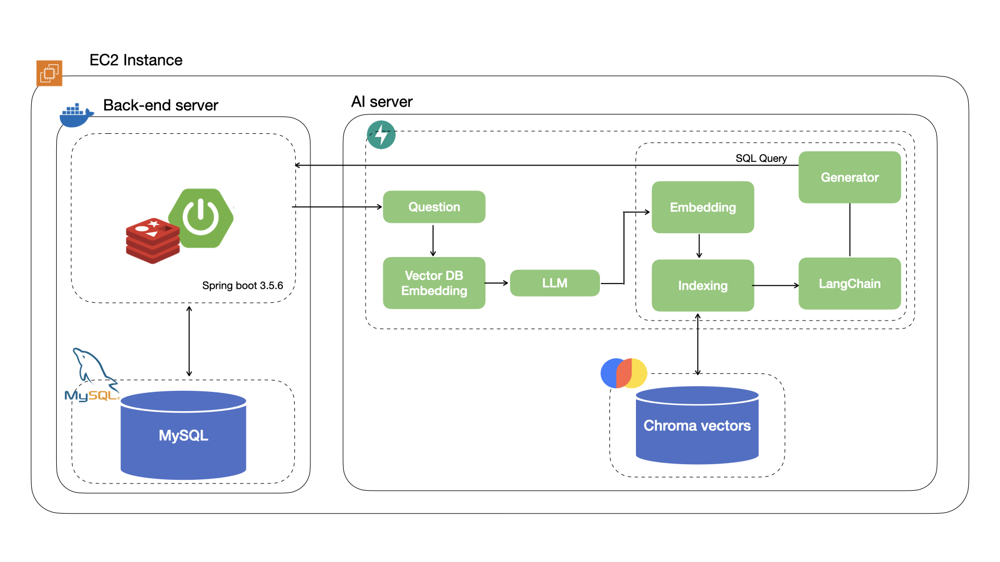

# 🛒 Ecommerce AI-Integrated Platform

## 📖 프로젝트 소개
사용자의 질문이나 요구사항을 분석하여 **최적의 상품을 추천**하고, 
대규모 트래픽 환경에서도 안정적인 주문 처리가 가능한 **AI 기반 이커머스 플랫폼**입니다. 
**Spring Boot** 기반의 견고한 백엔드 아키텍처 위에 **LLM과 Vector DB를 활용한 RAG 파이프라인**을 결합하여, 
단순 검색을 넘어선 **Text-to-SQL**을 제공하여 AI 기반 서비스로 확장하였습니다. 
모든 인프라는 AWS EC2 환경에서 컨테이너화하여 관리 효율성을 높였습니다.

---

## 🏗 시스템 구조

  

## 🪏 Stack
#### 🌟 Java, Spring boot, Spring security
#### 🌟 Python, Fast API, LangChain, LangGraph, Chroma vertors
#### 🌟 MySQL, Redis, Swagger
#### 🌟 AWS EC2, Docker
 

## 🚀 주요 기능

### 💡 백엔드 (Spring Boot)
- **Docker 기반 배포**로 환경 일관성과 확장성을 확보했습니다.  
- **Redis 캐싱**을 적용해 자주 조회되는 데이터를 빠르게 제공합니다.  
- **MySQL**로 사용자, 상품, 주문 등 핵심 이커머스 데이터를 구조적으로 관리합니다.

### 🧠 AI 서버 (FastAPI + LangChain) 
- 텍스트를 벡터로 변환해 **사용자 질문을 분석**하여 의미 기반 검색을 수행합니다.  
- **LangChain**을 이용하여 질문의 의도에 맞는 SQL 쿼리나 응답을 생성합니다.  
- 관련도가 높은 상품 정보를 **Chroma 벡터 유사도 검색**으로 빠르게 탐색합니다.  
- 검색 결과를 바탕으로 실행 가능한 SQL 쿼리문을 동적으로 생성하여 백엔드로 전달합니다.
  
[AI Server repo로 가기](https://github.com/zzichu/ecomerce-ai)

---

## ⚙️ 동작 흐름
1. 사용자가 백엔드로 질문을 보냅니다.  
2. 백엔드는 질문을 AI 서버로 전달합니다.  
3. AI 서버는 질문을 임베딩하고, Chroma Vector DB에서 관련 데이터를 탐색합니다.  
4. LangChain과 LLM이 검색 결과를 분석해 SQL 쿼리 또는 자연어 응답을 생성합니다.  
5. 백엔드는 실행된 쿼리 결과를 가공해 사용자에게 최종 응답을 반환합니다.

---

## 🌟 개발 의도
Text to SQL, **자연어를 통해 상품을 검색하는 서비스**를 만들고 싶었습니다.  
AI가 백엔드 로직과 직접 통신하며,  
데이터 조회부터 응답 생성까지 모두 자동화되는 구조를 실험했습니다.

## ERD Diagram

## API 명세서
[API 명세서 보기](https://zzichu.notion.site/e-comerce-Project-27964f2827ac804a9399f2dd4e0d7885)

